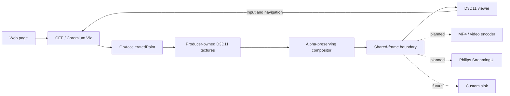

# Streaming Browser

**A GPU-first Chromium rendering and streaming foundation for transparent, interactive 4K browser surfaces.**

Render a webpage off-screen with CEF, keep its premultiplied-alpha frames on the GPU, and deliver them to a viewer—or, in future, to an MP4 encoder, StreamingUI, or another sink.

[**Run the demo**](#quickstart) · [Validation report](FINAL_REPORT.md) · [Technical research](docs/streaming-browser.md)


## Why Streaming Browser

Normal browser capture often means screenshots, CPU readback, lost transparency, or a video-specific pipeline. Streaming Browser provides a lower-level boundary: the fully composited Chromium frame as a shared GPU texture.

- **Transparent output** — preserves premultiplied alpha and validates opaque, translucent, and transparent pixels.
- **GPU-resident frames** — CEF, producer, and viewer exchange D3D11 textures without copying full 4K frames through the CPU.
- **Interactive streaming** — mouse, wheel, keyboard, focus, basic IME, navigation, and cursor state travel back to Chromium.
- **Change-driven delivery** — frames are produced when Chromium updates, capped at 30 fps, rather than duplicated continuously.
- **Sink-oriented direction** — the current sink is an interactive D3D11 viewer; planned sinks include MP4 recording, Philips StreamingUI, and application-defined consumers.

## Quickstart

### Requirements

- Windows 10 or 11, x64
- Visual Studio 2022 with the C++ desktop workload
- Windows SDK 10.0.26100
- CMake 3.21 or newer
- PowerShell

The first configure downloads and verifies the pinned CEF M150 distribution. CEF and build outputs are intentionally excluded from Git.

### Build

```powershell
.\scripts\configure.ps1
.\scripts\build.ps1 -Configuration Release
.\scripts\test.ps1 -Configuration Release
```

### Run the interactive demo

```powershell
.\scripts\run-demo.ps1 -Configuration Release
```

This starts:

1. `streaming_browser.exe` — the sandboxed, windowless CEF producer.
2. `streaming_viewer.exe` — the interactive D3D11 receiver.

For an interaction-focused page with a large slider:

```powershell
.\scripts\run-feedback-demo.ps1 -Configuration Release
```

Drag the slider in the viewer to exercise the complete feedback loop:

```text
viewer input → local IPC → CEF → webpage update → GPU frame → viewer
```

## How it works



The producer discovers Chromium's DXGI adapter, safely copies each temporary CEF texture, composites popup layers when supplied, and publishes final frames through a four-slot keyed-mutex ring. A logon-scoped named pipe carries versioned control messages and transfers the shared texture handles to one local viewer.

## Current capabilities

| Capability | Current state |
| --- | --- |
| Browser output | 3840 × 2160, up to 30 fps |
| Alpha | Premultiplied BGRA/RGBA, transparent background |
| Data path | Local D3D11 shared textures |
| Viewer | Aspect fit, 1:1 pan, fullscreen, checkerboard alpha preview |
| Input | Mouse, wheel, keyboard, focus, basic IME |
| Browser controls | URL, Back, Forward, Reload/Stop |
| Isolation | CEF sandbox bootstrap and per-logon pipe security |
| Consumers | One local viewer and one browser stream |

## Sink roadmap

The current implementation proves the browser-to-GPU-stream boundary. The next architectural step is to make consumers interchangeable without changing browser capture.

| Sink | Purpose | Status |
| --- | --- | --- |
| Interactive D3D11 viewer | Local preview and input feedback | Implemented |
| MP4/video sink | Record or encode browser output | Planned |
| Philips StreamingUI sink | Feed Philips' streaming surface format | Planned |
| Custom sink | Integrate another GPU, IPC, file, or network consumer | Future |

These future sinks are design goals, not implemented APIs yet.

## Performance and validation

On the validation laptop, the Release build sustained:

- **30.1 fps** over a 120-second 4K soak test
- **30.4 fps** over a final 60-second soak test
- approximately **130–153 MiB** producer working set
- approximately **68–70 MiB** viewer working set

The test suite covers protocol parsing, concurrent pipe I/O, alpha preservation, continuous frame delivery, navigation, mouse input, viewer visibility, reconnects, and packaged execution.

```powershell
.\scripts\test-alpha.ps1 -Configuration Release
.\scripts\test-e2e.ps1 -Configuration Release
.\scripts\test-soak.ps1 -Configuration Release -DurationSeconds 60
```

See the [full validation report](FINAL_REPORT.md) for measured results and known limitations.

## Project status

This is a working experimental Windows implementation, not yet a stable SDK. Important current boundaries:

- Windows x64 and D3D11 only
- one browser stream and one local viewer
- no MP4, StreamingUI, or network sink yet
- no HDR or audio transport
- binaries are not code-signed
- CEF M150 did not emit a popup-show callback for one tested HTML select case, although popup composition is implemented for delivered popup textures

## Repository guide

- [`src/producer/`](src/producer/) — CEF lifecycle, accelerated capture, compositor, and stream server
- [`src/viewer/`](src/viewer/) — stream client, D3D11 presentation, and interactive viewer UI
- [`src/common/`](src/common/) — protocol, named-pipe transport, logging, and Windows handle helpers
- [`tests/`](tests/) — protocol/IPC tests and deterministic browser fixtures
- [`scripts/`](scripts/) — configure, build, demos, validation, soak, and packaging
- [`docs/streaming-browser.md`](docs/streaming-browser.md) — original architecture research
- [`FINAL_REPORT.md`](FINAL_REPORT.md) — implementation and validation report

## Packaging

Create and validate a portable package:

```powershell
.\scripts\package.ps1 -Version 0.1.0
.\scripts\test-package.ps1 -Version 0.1.0
```

After extraction, run `prepare-sandbox.ps1` once, then `run-demo.ps1`.

## Contributing

Issues and focused pull requests are welcome. The most valuable next contributions are sink abstractions, encoded output, broader input coverage, profiling across more GPUs, and additional platform backends.

Before submitting a change, build both Debug and Release and run the unit plus end-to-end tests.

## License

A project-level license has not yet been declared. CEF and Chromium retain their respective licenses; generated packages include the CEF license and credits. Do not assume broader reuse rights for this repository until a project license is added.
